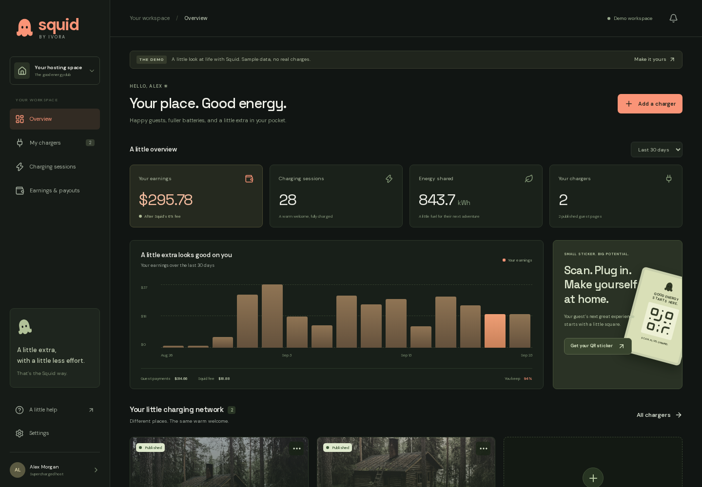

# Squid by Ivora

**A little charge. A better stay.**

Squid turns an OCPP charger at a vacation rental into a paid guest amenity. Hosts connect their charger, set a price, connect payouts, and print a QR sticker. Guests scan, authorize a card hold, charge, and pay for the energy delivered. The interface is dark, responsive, and designed for phones.

This is an Apache-2.0 reference application for the Ivora API. One Squid operator manages all hosts through one Ivora tenant. Squid owns guest access and payments: Stripe Connect routes 94% of the final charging amount to the host, with a 6% application fee for Squid. Ivora handles OCPP and metered billing through **external-funded charging sessions**, without using Ivora payment adapters.



## Try it locally

Requires Node.js 22 and npm. No credentials are needed for the interactive demo.

```sh
npm ci
npm run dev
```

Open [localhost:3000](http://localhost:3000), [the host demo](http://localhost:3000/demo), or [the guest demo](http://localhost:3000/c/demo). Demo data is clearly labeled. Demo charging never sends payment or hardware commands; added demo chargers stay in that browser.

For testing from a phone or another computer, set `NEXT_PUBLIC_APP_URL` in `.env` to the exact LAN URL you open, including the port (for example, `http://192.168.1.50:3000`), and restart the dev server. This sets the host allowed to load Next.js development assets, the origin accepted by Squid's forms, and the destination of sign-in email links. Both devices must be able to reach that address; `localhost` in an email points at the recipient's own device.

## Connect real services

```sh
cp .env.example .env
# Fill in .env locally. Never commit it.
npm run db:migrate
npm run check:setup
npm run dev
```

| Variable                            | Purpose                                                                                       |
| ----------------------------------- | --------------------------------------------------------------------------------------------- |
| `NEXT_PUBLIC_APP_URL`               | Canonical application origin, including your local port. Use HTTPS in production.             |
| `SUPABASE_URL`, `SUPABASE_ANON_KEY` | Supabase project and public auth key.                                                         |
| `SUPABASE_SERVICE_ROLE_KEY`         | Server-only administrative key. An anon key cannot replace it.                                |
| `SUPABASE_DB_URL`                   | Only needed to run the migration command. Use the direct or session pooler connection string. |
| `RESEND_API_KEY`                    | Optional server-only key for Squid-branded sign-in emails.                                    |
| `RESEND_FROM_EMAIL`                 | Sender on your verified domain, such as `Squid by Ivora <hello@squidcharge.io>`.              |
| `IVORA_API_URL`                     | Ivora API origin. The supplied `.co` endpoint is preproduction.                               |
| `IVORA_API_KEY`, `IVORA_TENANT_ID`  | Server-only credentials for Squid's shared fleet account.                                     |
| `GOOGLE_MAPS_ADDRESS_API_KEY`       | Server-only Google key with Places API (New) and Time Zone API enabled.                       |
| `OCPP_CREDENTIAL_KEY`               | Stable 32-byte encryption key as 64 hex characters; generate with `openssl rand -hex 32`.     |
| `STRIPE_SECRET_KEY`                 | Squid's Stripe platform secret key. Start with test mode.                                     |
| `STRIPE_WEBHOOK_SECRET`             | Signing secret for Squid's Stripe webhook endpoint.                                           |
| `CRON_SECRET`                       | A random secret protecting scheduled reconciliation.                                          |

### Supabase

Run the SQL files in `supabase/migrations` in filename order in the Supabase SQL editor, or supply `SUPABASE_DB_URL` and run `npm run db:migrate`. The command applies pending migrations in one transaction, records versions, and adopts an existing initial Squid schema without resetting data. Both the charging schema and email rate-limit migration are required when using Resend. Keep database credentials out of Vercel if using only the SQL editor.

Enable email authentication. Set the Supabase Auth Site URL to your canonical app origin and allow `<origin>/auth/callback` and `<origin>/login/confirm`.

The default host login uses email and password. Hosts can create an account, confirm their email, and use **Forgot password?** to recover access. Existing Google or email-link users can set a password from **Settings → Set or change your password**. New passwords require at least 8 characters and fit Supabase's 72-byte bcrypt limit; passwords are verified and stored by Supabase, never in Squid's application tables or logs. Sessions use server-managed HTTP-only cookies. Password login is throttled separately from account emails.

### Google sign-in

Create a Google OAuth **Web application** client and enable the Google provider in Supabase **Authentication → Sign In / Providers**, with its client ID and secret. These credentials belong in Supabase, not Squid's browser or Vercel environment. In Google Cloud, add `https://<project-ref>.supabase.co/auth/v1/callback` to **Authorized redirect URIs**. Set the consent screen's app name to your brand and add test users while the Google app is in testing mode.

In Supabase **URL Configuration**, allow `<origin>/auth/callback` for every intended Squid origin, including the LAN URL used during development. Squid starts a PKCE flow and exchanges the callback code on the server. The Google button reports unavailability if the provider is disabled; it becomes usable as soon as the provider is configured. `npm run check:setup` checks the live provider setting and prints both callback URLs. See the [Supabase Google setup guide](https://supabase.com/docs/guides/auth/social-login/auth-google).

All tables have row-level security. Hosts can read their own rows; writes go through server routes that validate identity, ownership, and input. Guests get a session-specific HTTP-only cookie, not database access.

### Resend email

Set `RESEND_API_KEY` and `RESEND_FROM_EMAIL` to use Squid's branded HTML and text emails from your verified domain. The backend generates a one-use Supabase sign-in token, delivers it through Resend, and verifies it only when the recipient presses **Sign in to Squid**. The link can be opened on another device. Email scanners cannot consume it with a GET request, and the token travels in the URL fragment rather than server request logs. Keep Resend click and open tracking disabled for authentication emails.

Signup confirmations and password reset messages also use Resend when configured. Recovery tokens open `/login/reset` and are consumed only when the user submits a new password. Without Resend, these flows use Supabase's configured SMTP delivery. For Supabase-delivered recovery, also allow `<origin>/auth/callback?next=/login/reset` in the redirect list. Existing email sign-in remains available as a secondary option.

The email route uses database-backed limits of one request per recipient per minute and ten requests per source per ten minutes. Recipient/source identifiers are HMAC digests. Vercel's trusted client-IP header supplies the source; local or other deployments share one conservative source bucket until they provide a trusted proxy adapter. Missing rate-limit tables block custom email delivery. These controls complement deployment-level bot protection.

Without a Resend key, Squid uses Supabase's configured email delivery and PKCE callback. That fallback link should be opened in the browser that requested it. Reusing another application's Resend key is supported; configure Squid's sender explicitly. Stripe webhook secrets belong to individual endpoints and must be provisioned for Squid rather than copied from another application's webhook.

Provider contracts: [Supabase custom email links](https://supabase.com/docs/reference/javascript/auth-admin-generatelink), [Resend sending API](https://resend.com/docs/api-reference/emails/send-email).

### Stripe Connect

Enable Connect in the platform account. Each host completes Stripe Express onboarding from Settings. Guest Checkout uses a $25 manual-capture authorization and a destination charge to that host's saved connected account.

Register `/api/stripe/webhook` for `checkout.session.completed` and `checkout.session.expired`. For local development:

```sh
stripe listen --forward-to localhost:3000/api/stripe/webhook
# Put the emitted whsec_ value in STRIPE_WEBHOOK_SECRET.
```

Squid verifies Stripe state on the server before starting a charger. After confirmed charging completion, it captures the immutable final Ivora bill and sets `application_fee_amount` to 6%, rounded to the nearest cent. Bills below Stripe's $0.50 USD minimum are waived: Squid releases the entire hold and records $0 collected, while preserving Ivora's metered bill. For a $10.00 charge, the host receives $9.40 and Squid receives $0.60 before Stripe processing fees. Processing fees are paid by the platform. Full refunds reverse both the host transfer and application fee. See [Stripe destination charges](https://docs.stripe.com/connect/destination-charges) and [manual capture](https://docs.stripe.com/api/payment_intents/capture).

Unplugging ends the physical transaction; reconciliation finalizes its bill and completes payment automatically. Ivora's completed session response may omit live usage, so retries settle from its immutable final bill without regressing to a starting state. A concurrent reconciliation returns the latest saved session, including any queued stop request. Guest polling keeps confirmed readings during transient failures and displays a retry notice only after repeated failures.

### Ivora and OCPP

The API key needs the tenant inventory, station provisioning, tariff, operation, and external-funded charging-session permissions. Configure an active OCPP domain for the tenant in Ivora. Squid uses the API's connection URL or a **ready** domain's connection URL template; DNS verification alone is not sufficient.

Hosts add a property, enter the station identity, OCPP URL, and password in their charger's configuration, then refresh setup. The station must be online and Stripe onboarding complete before its guest page can be published. One property currently represents one AC connector, up to 22 kW. Rate and authorization amounts are snapshotted for each session.

Address suggestions fill the property's location and time zone automatically. The server confirms the selected US street address, signs the selection for that host, and validates it when saving. Hosts never enter coordinates or time zones. Search is authenticated, throttled, and uses Google autocomplete session tokens. Enable Places API (New) and Time Zone API on the Google key's project. Demo onboarding uses clearly labeled sample addresses and needs no Google key.

New station identities use a shortened property name and a unique suffix, such as `bluebird-cabin-a1b2c3`, with at most 23 characters. Squid presets a random 16-character OCPP password using uppercase letters and digits without `I`, `O`, `0`, or `1`. The password is installed through Ivora's credentials API before setup completes. The `202609240001_charger_credentials.sql` migration stores it encrypted with AES-256-GCM in a service-only table. Keep `OCPP_CREDENTIAL_KEY` backed up and consistent across instances sharing this database; changing it prevents old passwords from being decrypted. Owners can retrieve their password from the authenticated setup dialog. Existing station identities and connection passwords stay valid; an existing charger can receive a preset through an explicit offline setup action.

Hosts without ready Stripe payouts see a fourth onboarding step. Their charger is saved before Stripe opens, retries reuse the saved charger, and both Stripe return and refresh URLs reopen that charger's setup. Squid checks the actual account status before publishing. Preview the first-host flow at `/demo?onboarding=1`.

The app connects chargers to Ivora's OCPP service. Vercel runs the web application and server routes; it does not host persistent OCPP WebSockets. API schema: [Ivora OpenAPI](https://api.ivoracharge.co/openapi.json).

## Deploy on Vercel

1. Import this repository with the Next.js preset and Node.js 22.x, matching the pinned runtime and CI.
2. Set the environment variables above for the intended environment. Use separate Supabase, Stripe, and Ivora test resources for previews.
3. Apply all Supabase migrations. Set `NEXT_PUBLIC_APP_URL` to the canonical HTTPS origin and add its Supabase callback and confirmation URLs. Configure the Resend sender if using custom email delivery.
4. Register the Stripe webhook against that origin and set its signing secret.
5. Set `CRON_SECRET`. The included `vercel.json` invokes `/api/cron/reconcile` every minute. Vercel supplies the bearer secret automatically.
6. Verify the complete flow with Stripe test accounts and a designated test charger. Print stickers only after choosing a stable public domain.

The every-minute job requires Vercel Pro or Enterprise under the current [Cron limits](https://vercel.com/docs/cron-jobs/usage-and-pricing). For a demo on Hobby, remove the cron entry. For real sessions, supply an external scheduler every minute with `Authorization: Bearer <CRON_SECRET>`; guest polling alone is insufficient because guests can close their browser.

Reconciliation processes ten sessions per invocation, oldest first. This is a small-fleet reference implementation, not an unbounded job queue. Monitor session age and increase scheduling capacity before growing the fleet.

### Squid preproduction

The `preproduction` branch deploys to [www.squidcharge.dev](https://www.squidcharge.dev) through the Vercel project `squid`. Make deployment changes on this branch and push to `origin/preproduction`.

In this project's **Settings → Environments → Production**, Branch Tracking is set to `preproduction`. Vercel calls the domain-serving environment **Production**, even though Squid uses it for preproduction with Stripe test mode and Ivora's `.co` API. Put this site's credentials in that Vercel environment. This also enables the every-minute reconciliation cron; Vercel does not run cron jobs on Preview deployments. See [Vercel Git deployments](https://vercel.com/docs/git) and [Cron Jobs](https://vercel.com/docs/cron-jobs).

Set `NEXT_PUBLIC_APP_URL=https://www.squidcharge.dev`. Register the Stripe test webhook at `https://www.squidcharge.dev/api/stripe/webhook`. In Supabase Auth URL Configuration, set the Site URL to that origin and allow:

```text
https://www.squidcharge.dev/auth/callback
https://www.squidcharge.dev/auth/callback?next=/login/reset
https://www.squidcharge.dev/login/confirm
```

Keep any LAN callbacks needed for local development. Store secrets in Vercel and the ignored local `.env`; `SUPABASE_DB_URL` is only needed locally for migrations. A future live deployment should use its own Vercel project and live service credentials.

## Verification

```sh
npm run typecheck
npm test
npx playwright install chromium
npm run test:e2e
npm run build
npm run format:check
```

Tests cover payment and fee invariants, settlement retries, ownership and guest access, actual SQL migration/RLS behavior in local PostgreSQL via PGlite, and desktop/mobile demo flows. Browser tests do not start physical chargers or spend money. To test an existing local dev server, set `E2E_BASE_URL` to its origin; `NEXT_PUBLIC_APP_URL` must match.

## Boundaries

This implementation has a USD/US model, one connector per property, a $25 hold, whole-session refunds, and a fixed 6% fee. Charging requests a stop at 85% of the hold or after 24 hours. Delayed meter reports or charger connectivity can still cause overages. Squid never silently caps a larger final bill or assumes a dispatched stop means the charger stopped. Uncertain outcomes remain reserved for operator review; see [recovery and architecture](docs/architecture.md).

The included policy pages identify the project as a demonstration. A live operator must provide their contact information and applicable policies, configure any required taxes, and validate their hardware and payment flows before accepting guests. The current code does not calculate tax, handle disputes, or provide an automated operator reconciliation console.

Contributions are welcome: [contributing](CONTRIBUTING.md), [security](SECURITY.md), [license](LICENSE), [asset notices](NOTICE.md). Squid is not affiliated with Airbnb. The license covers the code; it does not grant rights to third-party trademarks or the separately licensed demonstration photograph.
