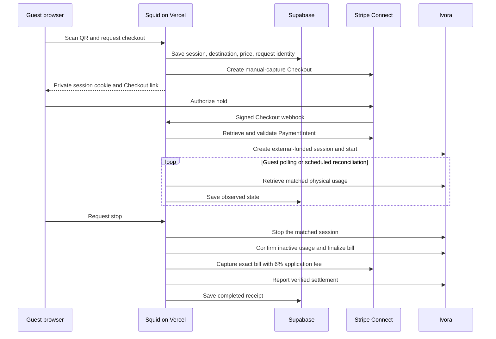

# Architecture and recovery

## Ownership

Supabase Auth identifies hosts. Every host route calls `getUser()` and verifies row ownership using the server-side database client. Browsers have no write grants. RLS permits hosts to read only their own records, and excludes payment references from direct session reads.

The fleet is one Ivora tenant, so Ivora resource IDs are never accepted as authorization from a browser. Station and connector IDs come from owned property rows. A QR slug identifies a published public page; it grants neither fleet access nor access to existing guest sessions. Guest access requires an HMAC cookie scoped to the session. Rotating the service-role key invalidates these cookies. Hosts and operators can still reconcile saved sessions.

## Host email

Hosts can sign in with a password, Google OAuth, or an optional email link. Password routes use Supabase's server client and return only success/errors; the resulting session lives in HTTP-only cookies. Sign-in is limited to 10 attempts per account and 30 per source per ten minutes, using HMAC identifiers in the existing quota table. Password changes require a verified Supabase user and are limited to five per account per ten minutes.

Google initiation is a same-origin POST. It checks that the provider is enabled, then creates a PKCE verifier cookie through the Supabase SSR client. `/auth/callback` exchanges the authorization code and redirects only to the dashboard or the fixed password-reset path. Google client credentials are stored in Supabase's provider configuration.

When Resend is configured, Squid calls the Supabase admin link generator only after acquiring PostgreSQL-backed email and source quotas. Signup, recovery, and email-link flows send their own HTML/text templates through Resend with purpose-specific idempotency keys derived from the generated token. Neither responses nor logs include the token, password, recipient, or provider error body. Email failure does not trigger a second delivery through another provider. Duplicate signup and unknown recovery addresses receive generic responses without changing existing passwords or creating a recovery account.

The email opens `/login/confirm` with the token in the fragment, which the browser removes after loading. An explicit same-origin POST to `/auth/confirm` exchanges it for Supabase session cookies. GET requests redirect legacy templates to the confirmation page without consuming the token. This supports opening mail on a different device and avoids consuming links through automated email scans. Reloading the confirmation screen requires reopening the original email link.

Recovery emails instead open `/login/reset`. After the user chooses and confirms a password, a POST verifies the token with Supabase's `recovery` purpose; a separate authenticated PATCH updates that user's password. No GET consumes a recovery token or changes a password. A failed password update can be retried using the verified session without replaying the consumed token.

Rate-limit rows contain HMAC digests of normalized email addresses and trusted source addresses; browser roles cannot read or update them. Expired entries older than a day are cleaned by cron. Without Resend, the existing Supabase OTP/PKCE delivery path remains available and uses Supabase's own email controls.

## Money and state

Amounts use integer US cents. Squid saves the host destination, rate, tariff, and hold before requesting Checkout. The server checks the PaymentIntent's session metadata, destination, currency, capture method, and authorization amount. A browser redirect has no authority to start charging.

External-funded Ivora sessions associate charging with Squid's verified external payment. No Ivora payment service or payment flow is created. A final capture requires inactive matched usage, a final bill for that same transaction, and a total within the authorization. The 6% application fee is calculated from this final total, not the hold.

`awaiting_payment → starting → charging → stopping → settling → completed` is the normal path. Physical and processor observations determine transitions. `canceled` means no payable charging was started; a zero-cost completed transaction receives a zero-cost receipt. `refunded` requires a confirmed successful refund. `review` reserves the connector when the outcome needs attention.

## Request durability

The unique client request UUID prevents duplicate checkout creation. A partial unique index permits only one nonterminal session per property. Database leases serialize session work across webhook, cron, and browser invocations. Leases expire after 90 seconds, longer than each route's 60-second execution window.

Before provider writes, `squid_operations` stores a stable key and a canonical hash of the request. A retry must use that key with the same payload. Provider results are saved for replay. When a Stripe response was never saved and the request is over 23 hours old, the app declines to replay it automatically because the processor's idempotency retention may have elapsed. Operators must inspect provider state first.

Saved start and stop operations are observed instead of replaced. Unknown outcomes do not get a fresh idempotency key. Refunds reverse the destination transfer and application fee. If capture succeeds but persistence fails, retrieving the existing PaymentIntent allows recovery without a second capture. The same approach handles canceled zero-cost authorizations.

## Scheduling

Guest pages poll while open. A protected cron route also reconciles up to ten sessions per minute, including abandoned Checkout sessions and pending refunds. Failed and pending entries rotate by update time so an outage cannot monopolize the batch. Locks prevent duplicate work; skipped work is retried in a later invocation.

Open, unpaid Checkout sessions expire through reconciliation after 30 minutes. Squid verifies expiration with Stripe before releasing the local reservation; a payment racing with expiration is reconciled on the next pass. Stripe's default 24-hour Checkout expiration remains a fallback if scheduling is unavailable.

The 85% stop threshold provides headroom, not an energy or cost guarantee. The app requests a stop after 24 hours as well. If an authorization has expired while confirmed usage is active, the app requests a stop and holds the session for review. Provider outages, stale meters, and offline stations require monitoring.

## Operator recovery

Use server-only access to inspect a `review` session together with its Ivora session, matched transaction, immutable bill, Stripe PaymentIntent, and durable operations. Do not expose those tables in a public admin page or copy raw credentials into an issue.

- Unknown start/stop: inspect the original Ivora operation and actual station transaction. Keep the property reserved until physical state is known. Do not dispatch a replacement with another key.
- Final bill above the authorization: do not capture beyond the authorized amount or alter the bill to fit. Resolve the difference with the guest and providers, then record the verified outcome.
- Stripe state differs from the saved bill/destination/fee: inspect the existing PaymentIntent and transfers. Never create a second payment merely to clear an error.
- Capture/refund succeeded but reporting failed: retry reconciliation using the original session and provider reference. The saved operation and observed provider state prevent duplication.
- Operation without a saved response is over 23 hours old: investigate it with the existing Stripe idempotency key and metadata before changing local records. There is no automated override.

No operator console is included in this first version. Resolve exceptional records through a controlled operator process only after confirming hardware and financial state. Test these recovery paths on dedicated test resources before live operation.
